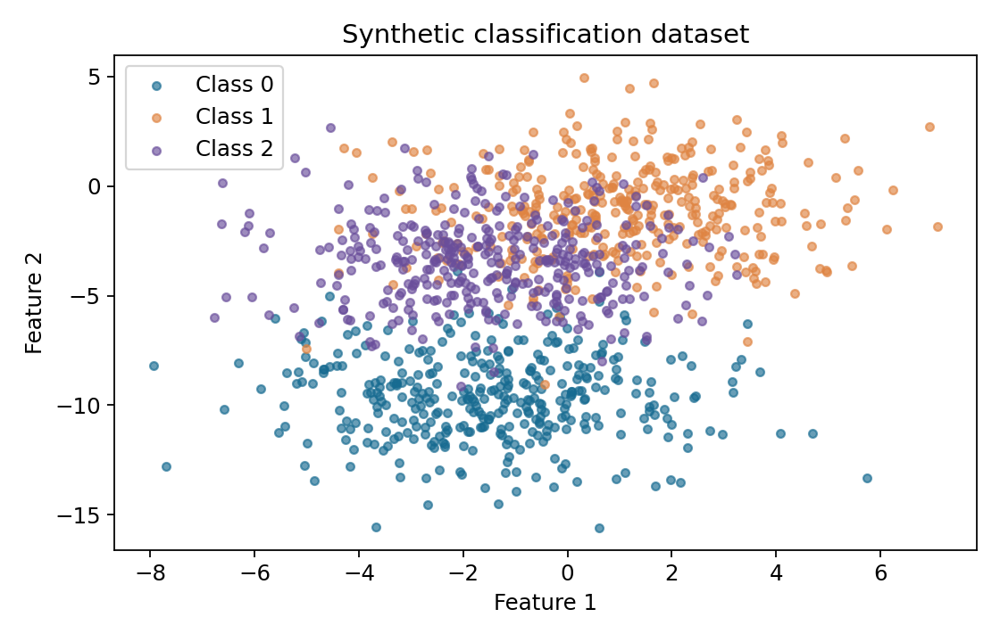
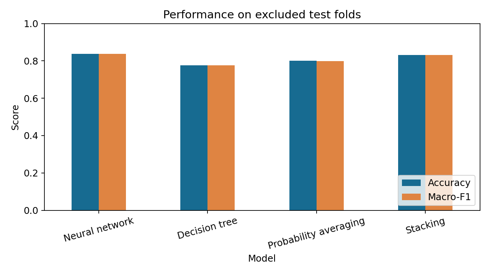
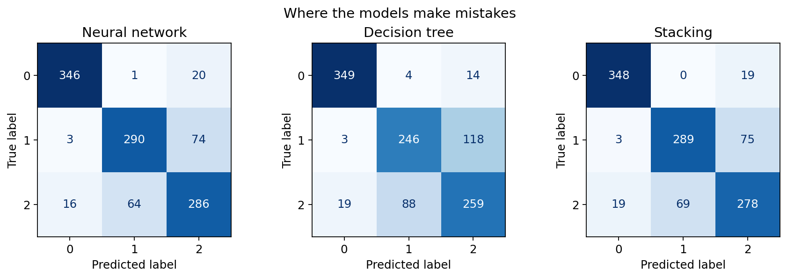

# Ensemble Learning with Stacking

Can combining two different classifiers produce better predictions than either model on its own? This university machine-learning project explores that question using a **neural network**, a **decision tree**, and a **stacking ensemble** for three-class classification.

The project covers the full experiment: generating and visualizing data, training models, combining their predictions, evaluating performance, and interpreting the results. A simple probability average provides an additional comparison to see whether a learned combiner adds value.

**Main finding:** stacking achieved **83.18% accuracy**, outperforming the decision tree and probability averaging, while the neural network alone achieved the best result at **83.82%**.

**[Explore the notebook](stacking.ipynb)** for the complete code, explanations, and saved outputs. You can read it directly on GitHub without running anything.

## Dataset

The experiment uses a synthetic dataset generated with scikit-learn's `make_blobs`:

- **1,100 observations**, with approximately equal class sizes: 367, 367, and 366.
- **Two numerical features**, allowing the data to be plotted directly.
- **Three overlapping classes**, creating examples that are difficult to classify.
- Fixed random seeds so the experiment can be reproduced.

Synthetic data keeps the focus on understanding ensemble learning. The features do not represent real-world measurements.



## How stacking works

Stacking trains a second model to combine the predictions of other models. Here, the neural network and decision tree each predict three class probabilities. These are joined into **six inputs** for a logistic-regression model, which produces the final prediction.

```text
                         Neural network ── 3 class probabilities ──┐
Input: two features ────┤                                         ├── Logistic regression ── Final class
                         Decision tree ─── 3 class probabilities ──┘
```

The two base models approach the problem differently: the neural network learns nonlinear relationships, while the shallow decision tree uses a small set of feature-based splits. Combining them may help when their errors differ, but it does not guarantee an improvement.

| Method | Configuration and purpose |
|---|---|
| Neural network | One hidden layer with 25 ReLU units, trained with Adam; input features are standardized. |
| Decision tree | Maximum depth of 2, providing a simple contrasting classifier. |
| Probability averaging | Averages the two models' probabilities with equal weights, without learning a combiner. |
| Stacking | Logistic regression learns how to combine the six class probabilities. |

## Training and evaluation

A fair comparison requires keeping test examples out of model training and parameter selection.

1. **Create five test folds.** Each round reserves 220 observations for testing and uses the other 880 for model development. All four methods are evaluated on the same test examples.
2. **Select the combiner's regularization.** The 880 development observations are split into 660 training and 220 validation examples. Seven values of logistic regression's `C` parameter are compared using validation macro-F1.
3. **Train stacking with out-of-fold predictions.** Five inner folds generate probabilities for examples that the base models did not train on. This prevents the combiner from learning from overly optimistic training predictions. Feature scaling is fitted within each training fold as well.
4. **Refit and test.** After selecting `C`, the models are refitted using all 880 development observations, with fresh out-of-fold predictions for the combiner. The reserved test fold is then evaluated.

Each observation receives one test prediction across the five rounds. The final scores combine those predictions. The base-model settings stay fixed; only the stacking combiner's regularization is selected using validation data.

**Accuracy** measures the proportion of correct predictions. **Macro-F1**, the main comparison metric, averages the F1 scores of the three classes equally, balancing precision and recall.

## Results

| Model | Accuracy | Macro-F1 |
|---|---:|---:|
| **Neural network** | **83.82%** | **0.8385** |
| Decision tree | 77.64% | 0.7760 |
| Probability averaging | 80.00% | 0.7997 |
| Stacking | 83.18% | 0.8317 |



Stacking improved accuracy by **5.55 percentage points** over the decision tree and **3.18 points** over probability averaging. However, it finished **0.64 points below** the neural network. The same ranking appears in macro-F1.

### Understanding the errors

The decision tree correctly classified **32 examples that the neural network missed**. Conversely, the neural network corrected **100 examples that the tree missed**, and both models were wrong on **146 examples**.

This shows that the tree offers some useful information, but the neural network is the stronger individual model. The learned combiner did not turn those complementary predictions into an overall improvement. These error counts use known labels to explain the results; they cannot tell us which model to trust on an unseen example.



The confusion matrices show which classes each method confuses. The notebook also includes per-fold scores to inspect variation across the test splits.

## What this project demonstrates

- Building and comparing individual classifiers and ensemble methods.
- Using class probabilities as inputs to a stacking model.
- Avoiding data leakage through out-of-fold predictions and training-only preprocessing.
- Separating validation-based parameter selection from test evaluation.
- Interpreting accuracy, macro-F1, confusion matrices, and differences in model errors.

The central lesson is that **an ensemble should be evaluated against its individual models, not assumed to be better**. In this experiment, the neural network remains the strongest choice.

## Limitations

This is a small synthetic experiment with fixed base-model settings. It does not establish real-world performance or a statistically significant difference between methods, and the training sets overlap across folds. A useful next step would be to repeat the comparison on a real tabular dataset or tune the base models using training data only.

## Run the project

Use **Python 3.12**. Clone the repository and install the dependencies, preferably in a virtual environment:

```bash
git clone https://github.com/ghaderi-m/Ensemble-Method-Stacking-in-ML.git
cd Ensemble-Method-Stacking-in-ML
python -m pip install -r requirements.txt
```

Open `stacking.ipynb` in VS Code with the Jupyter extension, or in an existing Jupyter installation. Select the Python environment where you installed the dependencies and run the cells in order. No dataset download is needed; the notebook generates the data and saves the figures locally.

## Files and tools

| File | Contents |
|---|---|
| [stacking.ipynb](stacking.ipynb) | Complete experiment, explanations, tables, and saved plots. |
| [figures/](figures/) | Dataset visualization, model comparison, and confusion matrices. |
| [requirements.txt](requirements.txt) | Pinned Python dependencies. |

**Tools:** Python, NumPy, pandas, scikit-learn, and Matplotlib.
